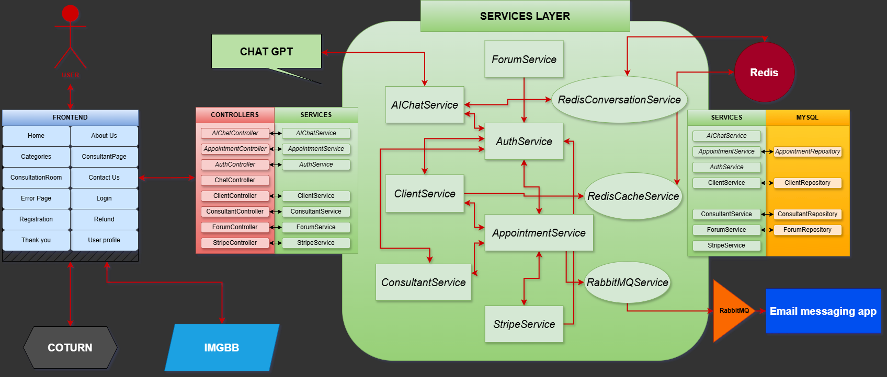

# AdvisorFlow | Online Consultancy App


⭐ **Feel free to cantact me!**

[AdvisorFlow](https://advisorflow.dariussongaila.dev) is my final project for the Vilnius Coding School Java course. Its primary feature is connecting users with experts who can answer their questions through Chat and Video Chat. Additionally, it offers the ability to post questions and receive answers that are visible to everyone, fostering a shared knowledge base for the community.


## **Technical Stack**
| **Category**          | **Technology**                          |
|------------------------|------------------------------------------|
| **Frontend**           | React, HTML, Tailwind CSS                |
| **Backend**            | Java, Spring Boot                       |
| **Database**           | MySQL                                   |
| **Caching**            | Redis                                   |
| **WebRTC Integration** | Coturn (TURN server)                    |
| **AI**                 | ChatGPT, Spring AI                      |
| **DevOps**             | Docker, Nginx, Ubuntu server            |
| **Tests**             | Mockito, Junit, Selenium                  |

---

## **Table of Contents**

- **[Overview](#advisorflow--online-consultancy-app)**  

- **[Installation & Setup](#installation-and-setup)**  
  - [Local Development](#local-setup)  
  - [Server Deployment](#server-setup)
  - [Database Setup](#database-setup)  

- **[Features for Users](#main-functionality-from-users-perspective)**  
  - [Client Features](#for-clients)  
  - [Expert Features](#for-experts)  

- **[Developer Insights](#main-functionality-from-developers-perspective)**  

- **[System Architecture](#architecture)**  

- **[Core Components](#purpose-of-key-components)**  

- **[Technical Stack & Dependencies](#dependencies)**  

- **[Unresolved Challenges](#problems-left-to-tackle)**  

- **[Future Roadmap](#future-possibilities)**  

     


# Installation and Setup

This guide provides step-by-step instructions to set up the AdvisorFlow project for both **local development** and **server deployment**.

---

## **Local Setup**

### Prerequisites
Ensure the following software is installed on your local machine:
- **Java Development Kit (JDK)** (v11+)
- **Docker Desktop**
- **Node.js** (for npm)
- **Git**

### Steps

1. **Install JDK**
   - Download and install JDK 11 or later from the [Oracle website](https://www.oracle.com/java/technologies/javase-jdk11-downloads.html) or [AdoptOpenJDK](https://adoptopenjdk.net/).
   - Verify the installation:
     ```bash
     java -version
     ```

2. **Set Up Docker**
   - Install Docker Desktop from [Docker's website](https://www.docker.com/products/docker-desktop/).
   - Verify the installation:
     ```bash
     docker --version
     ```

3. **Run Redis and RabbitMQ on Docker**
   - Pull and run the Redis container:
     ```bash
     docker run --name redis -p 6379:6379 -d redis redis-server --requirepass yourpassword

     ```
   - Pull and run the RabbitMQ container:
     ```bash
     docker run --name rabbitmq -p 5672:5672 -p 15672:15672 -d rabbitmq:management
     ```

4. **Clone Repositories**
   - Clone the backend repository:
     ```bash
     git clone https://github.com/DariusSo/OnlineConsultancyApp.git
     cd AdvisorFlow-backend
     ```
   - Clone the frontend repository:
     ```bash
     git clone https://github.com/DariusSo/ConsultancyAppFront.git
     cd AdvisorFlow-frontend
     ```

5. **Backend Setup**
    - Fill everything in application.properties
  
    
    
    - Build and run the backend application:

6. **Frontend Setup**
   - Navigate to the frontend directory and install dependencies:
     ```bash
     cd AdvisorFlow-frontend
     npm install
     ```
   - Change api url in globals.jsx
   - Start the frontend application:
     ```bash
     npm run dev
     ```

7. **Access the Application**
   - Visit the frontend application at [http://localhost:3000](http://localhost:3000).

---

## **Server Setup**

### Prerequisites
Ensure the following are installed on your server:
- **Ubuntu Server** (v20.04 or later)
- **Docker Engine**
- **Docker Compose**
- **Git**
- **Supervisor**
- **Coturn** (for TURN server)
- **Certbot** (for SSL certificates)

---

### Steps

1. **Install Java (JDK)**
   - Update the package list:
     ```bash
     sudo apt update
     ```
   - Install JDK:
     ```bash
     sudo apt install openjdk-11-jdk -y
     ```
   - Verify the installation:
     ```bash
     java -version
     ```

2. **Install Docker and Docker Compose**
   - Install Docker:
     ```bash
     sudo apt install docker.io -y
     ```
   - Start and enable Docker:
     ```bash
     sudo systemctl start docker
     sudo systemctl enable docker
     ```
   - Install Docker Compose:
     ```bash
     sudo apt install docker-compose -y
     ```
   - Verify the installations:
     ```bash
     docker --version
     docker-compose --version
     ```

3. **Run Redis and RabbitMQ Containers**
   - Run Redis with a password:
     ```bash
     docker run --name redis -p 6379:6379 -d redis redis-server --requirepass yourpassword
     ```
   - Run RabbitMQ:
     ```bash
     docker run --name rabbitmq -p 5672:5672 -p 15672:15672 -d rabbitmq:management
     ```

4. **Install Coturn (TURN Server)**
   - Install Coturn:
     ```bash
     sudo apt install coturn -y
     ```
   - Enable Coturn to start as a service:
     ```bash
     sudo systemctl enable coturn
     ```
   - Edit the Coturn configuration file:
     ```bash
     sudo nano /etc/turnserver.conf
     ```
     Add the following configuration:
     ```
     # Listening IP and Ports
     listening-port=3478
     tls-listening-port=5349

     # Relay IP and Fingerprint
     relay-ip=<YOUR_SERVER_PUBLIC_IP>
     fingerprint

     # Authentication and User Settings
     cli-password=yourpassword.
     user=your_user:your_password.
     lt-cred-mech

     # Domain and Realm
     realm=your-domain.com

     # Certificate for TLS
     cert=/etc/ssl/certs/your-cert.pem
     pkey=/etc/ssl/private/your-cert.key

     # Logging
     log-file=/var/log/turnserver.log
     simple-log
     ```
   - Restart the Coturn service:
     ```bash
     sudo systemctl restart coturn
     ```
   - Open the required ports in your firewall (if enabled):
     ```bash
     sudo ufw allow 3478/tcp
     sudo ufw allow 3478/udp
     sudo ufw allow 5349/tcp
     sudo ufw allow 5349/udp
     ```

5. **Clone Repositories**
   - Clone the backend repository:
     ```bash
     git clone https://github.com/DariusSo/OnlineConsultancyApp.git
     ```
   - Clone the frontend repository:
     ```bash
     git clone https://github.com/DariusSo/ConsultancyAppFront.git
     ```

6. **Backend Setup**
   - Fill everything in application.properties
  
    

   - Install **Supervisor**:
     ```bash
     sudo apt install supervisor -y
     ```
   - Create a Supervisor configuration file for the backend:
     ```bash
     sudo nano /etc/supervisor/conf.d/advisorflow-backend.conf
     ```
   - Add the following configuration:
     ```
     [program:advisorflow-backend]
     command=java -jar /path/to/AdvisorFlow-backend/target/advisorflow-0.0.1-SNAPSHOT.jar
     directory=/path/to/AdvisorFlow-backend
     autostart=true
     autorestart=true
     stderr_logfile=/var/log/advisorflow-backend.err.log
     stdout_logfile=/var/log/advisorflow-backend.out.log
     ```
   - Update Supervisor and start the backend process:
     ```bash
     sudo supervisorctl reread
     sudo supervisorctl update
     sudo supervisorctl start advisorflow-backend
     ```

7. **Frontend Setup**
   - Navigate to the frontend directory and build the frontend application:
   - Dont forget to change api url in globals.jsx
     ```bash
     cd AdvisorFlow-frontend
     npm install
     npm run build
     ```
   - Serve the frontend using Nginx:
     - Install Nginx:
       ```bash
       sudo apt install nginx -y
       ```
     - Configure Nginx to serve the frontend:
       ```bash
       sudo nano /etc/nginx/sites-available/advisorflow
       ```
       Add the following configuration:
       ```
       server {
           listen 80;
           server_name your-domain.com;

           root /path/to/AdvisorFlow-frontend/build;
           index index.html;

           location / {
               try_files $uri /index.html;
           }

            error_page 404 /index.html;

           location /api/ {
               proxy_pass http://localhost:8080/;
           }
       }
       ```
     - Enable the Nginx configuration:
       ```bash
       sudo ln -s /etc/nginx/sites-available/advisorflow /etc/nginx/sites-enabled/
       sudo systemctl restart nginx
       ```

8. **Access the Application**
   - Visit the application at `http://your-domain.com`.

# Database Setup

This section provides the SQL queries to create the required tables for the consultancy application database. Ensure the database is created and accessible before running these queries.

## SQL Queries to Create Tables

### 1. `clients` Table
```sql
CREATE TABLE clients (
    id BIGINT NOT NULL AUTO_INCREMENT,
    first_name VARCHAR(45) NOT NULL,
    last_name VARCHAR(45) NOT NULL,
    email VARCHAR(45) NOT NULL,
    password VARCHAR(1000) NOT NULL,
    role VARCHAR(45) NOT NULL,
    birth_date VARCHAR(45) NULL,
    phone VARCHAR(45) NULL,
    appointments_ids VARCHAR(1000) NULL,
    image_url VARCHAR(1000) NULL,
    PRIMARY KEY (id)
) ENGINE=InnoDB DEFAULT CHARSET=utf8mb4 COLLATE=utf8mb4_0900_ai_ci;
```

### 2. `consultants` Table
```sql
CREATE TABLE consultants (
    id BIGINT NOT NULL AUTO_INCREMENT,
    first_name VARCHAR(45) NOT NULL,
    last_name VARCHAR(45) NOT NULL,
    email VARCHAR(45) NOT NULL,
    password VARCHAR(1000) NOT NULL,
    role VARCHAR(45) NOT NULL,
    appointments_ids BIGINT NULL,
    categories VARCHAR(1000) NULL,
    available_time VARCHAR(1000) NULL,
    speciality VARCHAR(1000) NULL,
    description VARCHAR(1000) NULL,
    hourly_rate DOUBLE NULL,
    phone VARCHAR(45) NULL,
    image_url VARCHAR(1000) NULL,
    PRIMARY KEY (id)
) ENGINE=InnoDB DEFAULT CHARSET=utf8mb4 COLLATE=utf8mb4_0900_ai_ci;
```
### 3. `appointments` Table
```sql
CREATE TABLE appointments (
    id BIGINT NOT NULL AUTO_INCREMENT,
    title VARCHAR(45) NOT NULL,
    description VARCHAR(1000) NULL,
    category VARCHAR(45) NULL,
    user_id VARCHAR(45) NULL,
    consultant_id VARCHAR(45) NULL,
    time_and_date VARCHAR(45) NULL,
    price DOUBLE NULL,
    is_accepted TINYINT(1) NULL,
    is_paid TINYINT(1) NULL,
    uuid VARCHAR(1000) NULL,
    room_uuid VARCHAR(1000) NULL,
    stripe_session_id VARCHAR(1000) NULL,
    PRIMARY KEY (id)
) ENGINE=InnoDB DEFAULT CHARSET=utf8mb4 COLLATE=utf8mb4_0900_ai_ci;
```
### 4. `forum` Table
```sql
CREATE TABLE forum (
    id BIGINT NOT NULL AUTO_INCREMENT,
    name VARCHAR(45) NOT NULL,
    question VARCHAR(1000) NOT NULL,
    answer VARCHAR(2000) NULL,
    consultant_id VARCHAR(45) NULL,
    question_asked VARCHAR(45) NULL,
    PRIMARY KEY (id)
) ENGINE=InnoDB DEFAULT CHARSET=utf8mb4 COLLATE=utf8mb4_0900_ai_ci;
```

## **Main Functionality From User's Perspective**

### **For Clients:**
- Sign up or log in to the platform.
- Search for an expert, browse by category, or choose from newly registered experts.
- Make an appointment with a price set by the expert.
- Cancel an appointment before it is approved by the consultant to receive a full refund.
- Connect to the consultation room when the appointment time comes (not sooner than 5 minutes before the scheduled time).
- In the consultation room, clients can:
  - Connect to chat and video chat to communicate with the expert.
  - Use buttons to mute the microphone, turn off the camera, and disconnect.
- Ask questions in the consultant's profile and get answers that are visible to everyone.
- Use the free AI consultant for a chat.
- Edit their profile information.

### **For Experts:**
- Create an expert profile highlighting skills and expertise.
- Approve or disapprove appointments; if disapproved, the client receives a full refund.
- Connect to the consultation room when the appointment time comes (not sooner than 5 minutes before the scheduled time).
- In the consultation room, experts can:
  - Connect to chat and video chat to communicate with the client.
  - Use buttons to mute the microphone, turn off the camera, and disconnect.
- Answer client questions in their profile, with both the question and answer visible to everyone.
- Use the free AI consultant for a chat.
- Edit their profile information.

---

## **Main Functionality From Developer's Perspective**

#### **Navbar**


- **Features:**
  - **Categories:** Dropdown to browse consultants by predefined categories.
  - **AI Consultants:** Redirects to a page with AI-powered consulting options.
  - **Contact:** Leads to the contact page for user support.
  - **About Us:** Provides information about the platform.

#### **Home, Login, and Register Buttons**


- **Before Login:**
  - Includes "Home," "Login," and "Register" buttons.
- **After Login:**
  - The "Login" and "Register" buttons are replaced by "Profile" and "Logout."


---

### **Registration**

#### **Client Registration**
- **Endpoint:** `POST /auth/client`
- **Purpose:** Registers a new client account.
- **Process:**
  - Accepts JSON data with client details (e.g., name, email, and password).
  - Validates the data and ensures the user does not already exist.
  - Saves the new client in the database.
- **Responses:**
  - **200 OK:** Registration successful.
  - **400 Bad Request:** User with the same email already exists.
  - **500 Internal Server Error:** Database or processing error.

#### **Consultant Registration**
- **Endpoint:** `POST /auth/consultant`
- **Purpose:** Registers a new consultant account.
- **Process:**
  - Similar to client registration, but includes additional consultant-specific details.
  - Clears cached new consultants data to ensure up-to-date results.
- **Responses:**
  - **200 OK:** Registration successful.
  - **400 Bad Request:** Consultant with the same email already exists.
  - **500 Internal Server Error:** Database or processing error.

---

### **Login**

#### **Client Login**
- **Endpoint:** `POST /auth/login/client`
- **Purpose:** Authenticates clients and issues a JWT token.
- **Process:**
  - Accepts JSON data with client email and password.
  - Verifies the credentials against the database.
  - Issues a token for subsequent authenticated requests.
- **Responses:**
  - **200 OK:** Login successful, returns the JWT token.
  - **401 Unauthorized:** Incorrect email or password.
  - **500 Internal Server Error:** Database or processing error.

#### **Consultant Login**
- **Endpoint:** `POST /auth/login/consultant`
- **Purpose:** Authenticates consultants and issues a JWT token.
- **Process:**
  - Similar to client login, but validates consultant-specific credentials.
- **Responses:**
  - **200 OK:** Login successful, returns the JWT token.
  - **401 Unauthorized:** Incorrect email or password.
  - **500 Internal Server Error:** Database or processing error.

---

### **Newest Consultants**


- **Endpoint:** `GET /newest`
- **Purpose:** Retrieves the 10 newest consultants, cached in Redis for quick access.
- **Details:**
  - Displays consultant details: name, specialty, category, email, and hourly rate.
  - Includes a "More Info" button for detailed profiles.
- **Responses:**
  - **200 OK:** Returns a list of consultants.
  - **500 Internal Server Error:** Redis or database issue.

---

### **Search Consultants**


- **Endpoint:** `GET /search`
- **Purpose:** Filters consultants based on:
  - Price range (`minPrice`, `maxPrice`).
  - Specialty.
  - Category.
  - Availability (`date`).
- **Responses:**
  - **200 OK:** Returns a filtered list of consultants.
  - **500 Internal Server Error:** Database or processing issue.

---

### **AI Consultants**


- **Endpoint:** `GET /ai`
- **Purpose:** Allows clients to interact with an AI consultant for automated advice.
- **Process:**
  - Accepts a message and consultant category.
  - Returns an AI-generated response tailored to the category.
- **Responses:**
  - **200 OK:** Returns the AI's response.
  - **500 Internal Server Error:** Processing issue.

---

### **Booking Interface**


- **How It Works:**
  - Users select a time slot, provide appointment details, and confirm their booking.
  - Once the time is selected, the "Book Appointment" button becomes active. Clicking it initiates the booking process by calling the **Stripe Checkout Session**.

### **Appointment Details**


- **Fields:**
  - **Appointment Title:** A brief description of the session.
  - **Problem Description:** Detailed explanation of the client’s issue.
  - **Select Available Time:** Users can pick a date and time from the consultant's available schedule.


- After selecting the date, clients can confirm the appointment by clicking **Book Appointment**, which triggers a backend call to create a **Stripe Checkout Session**.

---

### **Stripe Checkout**
- **Endpoint:** `POST /create-checkout-session`
- **Purpose:** Initiates a Stripe session for payment processing.
- **Process:**
  1. Receives appointment details, including consultant ID, date, and price.
  2. Checks if appointment is new.
  3. Removes date from experts time table.
  4. Creates a **Stripe Checkout Session** and returns the session ID.
  5. Redirects the client to the Stripe payment page.
- **Responses:**
  - **200 OK:** Returns the Stripe session ID.
  - **400 Bad Request:** Issues with the payment or invalid data.
  - **500 Internal Server Error:** Stripe or database issue.

### **Payment Confirmation**
- **Endpoint:** `GET /redirect`
- **Purpose:** Updates the appointment's payment status upon successful payment.
- **Process:**
  - The client is redirected to a success or error page depending on the payment outcome.
  - Updates the database to mark the appointment as paid.
- **Responses:**
  - Redirects to:
    - **Success Page:** `http://advisorflow.dariussongaila.dev/thanks`
    - **Error Page:** `http://advisorflow.dariussongaila.dev/error`

### **Refund and Cancellation**


- **Endpoint:** `DELETE /refund`
- **Purpose:** Cancels appointments and processes refunds via Stripe.
- **Process:**
  1. Validates consultant or client access for cancellation.
  2. Issues a refund via Stripe.
  3. Updates the appointment status in the database.
- **Responses:**
  - **200 OK:** Refund successful.
  - **401 Unauthorized:** Unauthorized access.
  - **418 I’m a Teapot:** Late cancellation attempt.
  - **500 Internal Server Error:** Stripe or database issue.

---

### **Consultation Dashboard**
#### **Approved and Pending Consultations**


- **Approved Consultations:**
  - Displays confirmed appointments with a "Connect" button to join the session.
- **Pending Consultations:**
  - Lists unapproved appointments with options to approve or cancel.
  - Consultants can accept or decline pending appointments.

---

### **Consultant Actions**
#### **Approve or Cancel Appointments**


- **Approve Appointment**
  - **Endpoint:** `PUT /appointments`
  - **Purpose:** Marks an appointment as confirmed in the database.
  - **Process:** Consultants validate their access and approve the pending request.
  - **Responses:**
    - **200 OK:** Appointment approved.
    - **401 Unauthorized:** Consultant lacks access.
    - **500 Internal Server Error:** Database issue.

- **Cancel Appointment**
  - **Endpoint:** `DELETE /refund`
  - **Purpose:** Cancels the appointment and refunds the client.

---

### **Real-Time Communication**
#### **Video Chat and Messaging**


- **Technology:** 
  - **WebRTC** for peer-to-peer video chat.
  - **WebSocket** for real-time messaging.

- **Process:**
  1. Clients and consultants use the "Connect" button to join the session.
  2. The system exchanges signaling data (offers, answers, and ICE candidates) through WebSocket endpoints to establish the video call.
  3. Text messages are broadcasted in real time through the `/consultation/{roomUuid}` endpoint.

- **Endpoint:** `GET /appointments/connect`
  - **Purpose:** Verifies and grants access to the video chat room.

---

### **Consultant Profile View**


- **Details:**
  - Consultant’s name, specialty, email, and phone number.
  - Hourly rate and a "Book Appointment" button.
- **Purpose:**
  - Allows clients to browse consultant details and book sessions directly.

### **View Appointments**


- **Dashboard:**
  - Displays **approved** and **pending** appointments for both clients and consultants.
  - Clients can cancel pending appointments, while consultants can approve or decline them.

---

### **Ask a Question**


- **Endpoint:** `POST /forum`
- **Purpose:** Allows clients to post questions visible to all consultants.
- **Process:**
  - Accepts a `ForumMessage` object containing the question details.
  - Saves the question in the database for consultants to review and answer.
- **Responses:**
  - **200 OK:** Question posted successfully.
  - **500 Internal Server Error:** Issues with saving the question.

---

### **Answer a Question**


- **Endpoint:** `PUT /forum`
- **Purpose:** Enables consultants to reply to questions posted by clients.
- **Process:**
  - Accepts the message ID and reply content.
  - Validates consultant's access using the provided JWT token.
  - Saves the response in the database, visible to all users.
- **Responses:**
  - **200 OK:** Reply posted successfully.
  - **401 Unauthorized:** Consultant lacks permission to respond.
  - **500 Internal Server Error:** Issues with saving the reply.

---

- **Endpoint:** `GET /forum`
- **Purpose:** Fetches all forum messages related to a specific consultant.
- **Process:**
  - Accepts the consultant's ID as a parameter.
  - Returns a list of all public questions and their corresponding answers.
- **Responses:**
  - **200 OK:** Forum messages retrieved successfully.
  - **500 Internal Server Error:** Issues with fetching the messages.

---

### **Client Profile**


- **Features:**
  - Displays the client's name, email, and phone number.
  - Allows clients to update their profile details using the **Edit Profile** button.

#### **Edit Client Profile**
- **Endpoint:** `PUT /edit`
- **Purpose:** Updates the client’s personal details.
- **Process:**
  - Accepts the updated client information as a JSON object.
  - Updates the database with the new details.
- **Responses:**
  - **200 OK:** Profile updated successfully.
  - **500 Internal Server Error:** Issues with updating the profile.

---

### **Consultant Profile**


- **Features:**
  - Displays the consultant's name, specialty, email, phone number, and description.
  - Provides options to:
    - **Edit Profile**
    - **Add Photo**
    - **Access Forum**

#### **Edit Consultant Profile**
- **Endpoint:** `PUT /edit`
- **Purpose:** Updates the consultant’s personal details.
- **Process:**
  - Accepts the updated consultant information as a JSON object.
  - Updates the database with the new details.
- **Responses:**
  - **200 OK:** Profile updated successfully.
  - **500 Internal Server Error:** Issues with updating the profile.

---

### **Manage Available Times**


- **Features:**
  - Consultants can add or remove available time slots.
  - These slots are visible to clients during the booking process.

#### **Fetch Availability**
- **Endpoint:** `GET /dates`
- **Purpose:** Retrieves all available dates and times for a specific consultant.
- **Process:**
  - Accepts the consultant’s ID as a parameter.
  - Fetches availability details from the database.
- **Responses:**
  - **200 OK:** Dates retrieved successfully.
  - **400 Bad Request:** Consultant not found.
  - **500 Internal Server Error:** Issues with fetching dates.

#### **Add or Remove Time Slots**
- Consultants can add new time slots by selecting a date and time and clicking **Add Time**.
- Removing a time slot updates the availability in real time.

### **More endpoints**

You can find all endpoints in endpoints.yaml file.

## **Architecture**

### **Schema Diagram**
Below is the high-level architecture of the backend, showing how different components interact:



---

### **Purpose of Key Components**

1. **Controllers**:
   - Handle incoming HTTP requests and map them to the service layer.

2. **Service Layer**:
   - Encapsulates business logic, connects to the repository layer, and integrates external APIs like ChatGPT and Stripe.

3. **Repository Layer**:
   - Interacts with the MySQL database using JPA.

4. **Redis**:
   - Used for caching frequently accessed data such as consultant profiles and availability.

5. **RabbitMQ**:
   - Used for handling asynchronous tasks like sending email notifications for appointments.

6. **Coturn**:
   - Provides TURN server functionality for WebRTC-based video calls.

7. **IMGBB**:
   - Used for managing and storing user-uploaded images, such as profile pictures.

8. **ChatGPT**:
   - Provides AI-driven consultation capabilities.

---

### **Dependencies**

Below is a list of key dependencies used in the backend and their purposes:

#### **Core Dependencies**
1. **Spring Boot**:
   - `spring-boot-starter-web`: For building RESTful web services.
   - `spring-boot-starter-data-jpa`: For database interactions with MySQL.
   - `spring-boot-starter-websocket`: For real-time WebSocket communication.
   - `spring-boot-starter-test`: For testing (JUnit, Mockito).

2. **Database**:
   - `mysql-connector-java`: MySQL driver for database connections.
   - `h2`: In-memory database for development and testing.

#### **Authentication**
- `jjwt-api`, `jjwt-impl`, `jjwt-jackson`: For JSON Web Token (JWT) handling.

#### **AI Integration**
- `spring-ai-openai-spring-boot-starter`: For integrating ChatGPT via OpenAI.

#### **Payment Gateway**
- `stripe-java`: For integrating Stripe for payment processing.

#### **Real-Time Communication**
- `spring-boot-starter-websocket`: To enable WebRTC signaling via WebSockets.
- `redis.clients:jedis`: For caching WebRTC signaling data using Redis.

#### **Caching**
- `spring-boot-starter-data-redis`: For caching frequently accessed data.

#### **Message Broker**
- `amqp-client`: For integrating RabbitMQ for asynchronous messaging.

#### **Encryption and Security**
- `org.mindrot:jbcrypt`: For secure password encryption and validation.

#### **JSON Handling**
- `org.json:json`: For parsing and working with JSON objects.

#### **Utility**
- `lombok`: To reduce boilerplate code with annotations like `@Getter`, `@Setter`, etc.
- `jackson-databind`: For serializing and deserializing Java objects to/from JSON.

---

## **Problems Left to Tackle**

Despite the progress made in developing AdvisorFlow, there are still some challenges and issues to address:

- **Scalability for Real-Time Communication**:  
  The current WebRTC setup with Coturn may face scalability issues as the number of simultaneous video calls increases. A distributed TURN server setup might be required.

- **Enhanced Error Handling**:  
  Improve error handling mechanisms across the backend and frontend to ensure better user experience and debugging capabilities.

- **Improved User Notifications**:  
  Notifications for appointment updates, cancellations, and other events are handled via RabbitMQ but lack in-app notifications. Adding a real-time notification system would improve user experience.

- **Frontend Performance Optimization**:  
  Optimize the React frontend for faster load times, especially for consultant searches and dashboard views with large datasets.

- **Tests**:  
  For now testing was minimal, made only to match specifict requirements for a final project.

- **Consultant Availability Management**:  
  Enhance the UI/UX for managing time slots, including bulk editing and setting recurring availability schedules.

- **Mobile Responsiveness**:  
  While the current design is functional, some pages require better responsiveness for mobile devices.

---

## **Future Possibilities**

- **Mobile Application**:  
  Build native mobile applications for iOS and Android to improve accessibility and user experience.

- **Multi-Language Support**:  
  Add multi-language support to the platform to cater to users from diverse linguistic backgrounds.

- **Analytics Dashboard**:  
  Provide consultants with a dashboard to track their appointments, earnings, and client reviews.

- **In-App Notifications**:  
  Implement real-time, in-app notifications for updates on appointments, payments, and messages.

- **Recording Consultations**:  
  Add the ability for users and consultants to record video consultations, ensuring privacy and compliance with applicable laws.

- **AI Model Customization**:  
  Allow consultants to upload their own knowledge base or guidelines for a personalized AI assistant tailored to their expertise.

- **Integration with Calendar Services**:  
  Integrate with third-party calendars like Google Calendar and Microsoft Outlook for better appointment management.

- **Custom Payment Options**:  
  Expand payment gateway options beyond Stripe to include PayPal, bank transfers, and other local payment methods.

- **Subscription Model**:  
  Introduce a subscription plan for users who want unlimited access to specific consultants or AI-powered consultations.

- **Enhanced Search Functionality**:  
  Add advanced filters and sorting options for finding consultants based on ratings, response times, and availability.

- **Consultant Reviews and Ratings**:  
  Allow clients to leave reviews and ratings for consultants to build credibility and trust within the platform.

- **Security Enhancements**:  
  Conduct regular security audits and implement features like 2FA (Two-Factor Authentication) for added protection.

- **Load Testing and Scaling**:  
  Perform load testing and deploy autoscaling infrastructure to ensure seamless performance during peak loads.

- **Continuous Deployment (CD)**:  
  Automate deployment pipelines using CI/CD tools like Jenkins, GitHub Actions, or GitLab CI for faster updates and maintenance.
